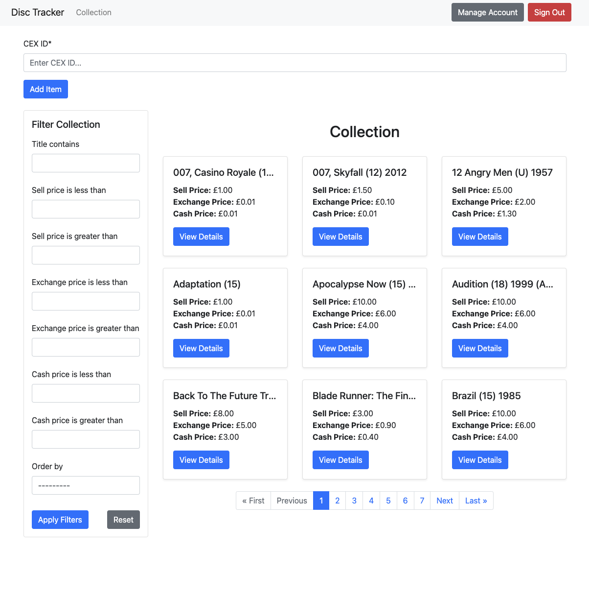

# 💿 Disc Tracker

A web application that allows users to store their disc (Blurays, Games etc) collection and track their prices via the CEX API.



## 💻 What It Does

The application communicates with the public CEX API and:

- Adds items (by CEX ID) to the user's collection
- Fetches prices of items at regular intervals and updates accordingly
- Visualises price history for each item with a line chart 
- Filters and paginates through collection  

## ✨ Features

- 👤 User Accounts – Create and manage your profile to keep track of your personal collection.
- 🔐 Secure Login – Collection is protected with user authentication and authorisation.
- 📦 Collection Management – Add, remove, and manage your collection.
- 📈 Automatic Price Updates – Prices are refreshed from the CEX API at regular intervals for up-to-date tracking.
- 📊 Price History Charts – View historical prices for each item with interactive line charts.
- 🏷️ Filtering & Sorting – Search, filter, and sort your collection by name and prices (sell, exchange, cash).

## How To Use It

### 🌍 Accessing Online

Disc Tracker is hosted online, so no need to install anything - just visit:

[disc-tracker.co.uk](https://disc-tracker.co.uk)

Sign up, add to your collection and start tracking prices instantly!

### 💻 Running Locally (Optional)

If you would like to run the app locally then please do!

<details>
    <summary> Here is how you might want to set it up.</summary>

#### Prerequisites

- Python
- Docker & Docker Compose

#### Installation

Clone this repository:
```bash
git clone https://github.com/jakecreely/DiscTracker.git
cd DiscTracker
```

#### Setup Environment:

A [docker-compose.yml](DiscTracker/docker-compose.yml) is provided which setups up the services required for local development with a:
  - Django App
  - Postgres Database
  - Celery Worker
  - Celery Beat
  - Redis

It needs environment variables to start up which should be stored in .env inside the root of the project. Here is an example `.env` file which should work fine with your own `SECRET_KEY`

```sh
SECRET_KEY= ## CREATE YOU OWN SECRET KEY ##
DEBUG=True

DATABASE_NAME=disc-tracker
DATABASE_USER=postgres
DATABASE_PASSWORD=postgres
DATABASE_HOST=db
DATABASE_PORT=5432

POSTGRES_DB=disc-tracker
POSTGRES_USER=postgres
POSTGRES_PASSWORD=postgres

REDIS_URL=redis://redis:6379/0
```

#### Running The App

1. Start the containers using docker compose up (by default this looks for docker-compose.yml) and run in detatched mode.
```bash
docker compose up -d --build
```

2. Once the app is running we need to execute some commands in the django app.
-  Run any database migrations
```bash
docker exec -it disc-tracker_app python manage.py migrate
```

-  Create a superuser to access admin dashboard
```bash
docker exec -it disc-tracker_app python manage.py createsuperuser
```

-  Setup the celery task to update prices at regular intervals
```bash
docker exec -it disc-tracker_app python manage.py setup_price_history_periodic_task
```

Head to [localhost:8000](localhost:8000) to start using the application!

</details>

## ⚙️ How to Use It

1. **Create An Account**: Sign up using your email
2. **Verify Account**: A verification email will be send, you will need to verify before being able to use the app
3. **Add To Collection**: Go to the "Collection" page and add the CEX ID of the item and press "Add Item". The CEX ID can be found the URL of the item on the [CEX website](https://uk.webuy.com/). 
E.g. `https://uk.webuy.com/product-detail?id=5027035012124`
4. **Check Price Changes**: Once you've added your collection, you can check back to see the price changes.

## 📦 What's Being Stored

For each item we store:
- Title
- Sell Price - the price CEX are selling the item for
- Exchange Price - the price CEX will purchase the item for vouchers
- Cash Price - the price CEX will purchase the item for in cash

When the price of an item changes we store a price history entry. Which has all of the above and the date. We create an entry when at least of the prices has changed so if not entries are being created then the item hasn't changed price.

## ❤️ Motivations
I have a collection of Blu-rays and DVD and wanted a way of tracking the price of them and as CEX is a popular buyer/seller with a (kind of) public API I thought why not use them as a baseline for prices. 

I wanted to work on my Python skills so this started as a basic CLI application for personal use. I enjoyed the project and felt it had potential to grow so it became a Django application and has gone on from there. I was keen to get this deployed and this has been my focus over the last couple weeks which has been a great learning experience.

I'm keen to continue adding features and building my understanding of deployment!

## 🚀 What's Next
- 🏆 Wishlisting – Track items you're interested in buying.
- 📊 Wider Range Of Statistics - View price of whole collection etc
- 🔔 Price Change Alerts – Get notified when an item in your collection drops or increases in price.
- 🌍 Deployment Scalability and Refinement
- 🌐 Responsive Design – Across desktop and mobile devices.